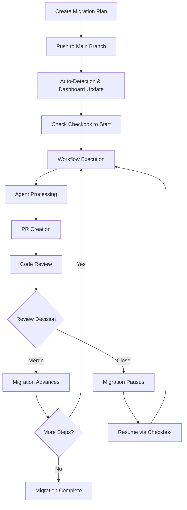
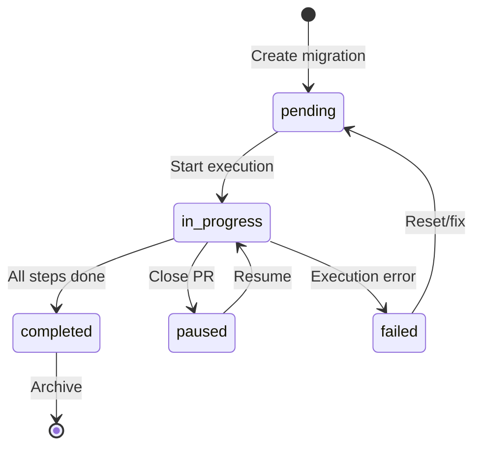

# Hachiko Migration Flow Guide

This comprehensive guide walks you through the complete migration lifecycle in Hachiko, from creating a migration plan to completion. Whether you're using the GitHub App or GitHub Actions deployment, this document covers all aspects of managing code migrations.

## Table of Contents

- [Overview](#overview)
- [Migration Lifecycle](#migration-lifecycle)
- [Step 1: Creating a Migration Plan](#step-1-creating-a-migration-plan)
- [Step 2: Migration Detection and Dashboard Creation](#step-2-migration-detection-and-dashboard-creation)
- [Step 3: Starting a Migration](#step-3-starting-a-migration)
- [Step 4: Migration Execution](#step-4-migration-execution)
- [Step 5: Review and Merge](#step-5-review-and-merge)
- [Step 6: Completion and Tracking](#step-6-completion-and-tracking)
- [Migration States](#migration-states)
- [Control and Monitoring](#control-and-monitoring)
- [Troubleshooting](#troubleshooting)
- [Best Practices](#best-practices)

## Overview

Hachiko provides two deployment modes with slightly different workflows:

| Feature               | GitHub App                      | GitHub Actions        |
| --------------------- | ------------------------------- | --------------------- |
| **Migration Control** | Issue comments (`/hachi pause`) | Dashboard checkboxes  |
| **State Storage**     | Database                        | Migration documents   |
| **Dashboard**         | Real-time updates               | Issue-based dashboard |
| **Agent Integration** | Direct API calls                | Cloud agent APIs      |

This guide covers both workflows, with GitHub Actions being the current focus.

## Migration Lifecycle



## Step 1: Creating a Migration Plan

### Migration Document Structure

Create a markdown file in the `migrations/` directory with the following structure:

```markdown
---
schema_version: 1
id: my-migration-id
title: "Human-readable migration title"
agent: mock  # or devin, cursor, codex
status: pending
current_step: 1
total_steps: 3
created: 2024-12-16T10:00:00Z
last_updated: 2024-12-16T10:00:00Z
---

# Migration Title

Brief description of what this migration accomplishes.

## Context

Explain why this migration is needed:
- Business requirements
- Technical debt to address
- Dependencies or prerequisites

## Migration Strategy

Detailed step-by-step approach:
1. **Step 1 Name**: Description of what step 1 does
2. **Step 2 Name**: Description of what step 2 does
3. **Step 3 Name**: Description of what step 3 does

## Technical Details

### Requirements
- List specific technical requirements
- Dependencies that must be in place
- Tools or configurations needed

### Implementation Approach
Detailed instructions for the AI agent:
- Code patterns to follow
- Files to modify
- Testing requirements
- Quality gates

## Success Criteria

- ✅ Criterion 1: Specific measurable outcome
- ✅ Criterion 2: Another measurable outcome
- ✅ All tests pass
- ✅ Code coverage maintained
- ✅ No linting errors

## Risk Assessment

- **Risk Level**: Low/Medium/High
- **Impact**: Description of potential impact
- **Rollback**: How to rollback if needed
- **Mitigation**: Steps to reduce risks
```

### Frontmatter Fields Reference

| Field            | Required | Description                                               |
| ---------------- | -------- | --------------------------------------------------------- |
| `schema_version` | Yes      | Always use `1`                                            |
| `id`             | Yes      | Unique identifier (kebab-case)                            |
| `title`          | Yes      | Human-readable title                                      |
| `agent`          | Yes      | `mock`, `devin`, `cursor`, or `codex`                     |
| `status`         | Yes      | `pending`, `in_progress`, `paused`, `completed`, `failed` |
| `current_step`   | Yes      | Current step number (starts at 1)                         |
| `total_steps`    | Yes      | Total number of steps                                     |
| `created`        | Yes      | ISO 8601 timestamp                                        |
| `last_updated`   | Yes      | ISO 8601 timestamp                                        |
| `branch`         | No       | Current working branch (auto-generated)                   |
| `pr_number`      | No       | Current PR number (auto-generated)                        |
| `error`          | No       | Error message if failed                                   |

### Agent Selection Guide

| Agent    | Best For               | Timeout | Capabilities                |
| -------- | ---------------------- | ------- | --------------------------- |
| `mock`   | Testing, documentation | N/A     | Simulated changes only      |
| `devin`  | Complex refactoring    | 600s    | Full codebase understanding |
| `cursor` | Code improvements      | 1200s   | IDE-like code editing       |
| `codex`  | Specific code tasks    | 600s    | GPT-4 powered coding        |

## Step 2: Migration Detection and Dashboard Creation

### Automatic Detection

When you push a migration document to the main branch:

1. **GitHub Actions Workflow**: The `detect-migrations.yml` workflow automatically runs
2. **Migration Validation**: Validates the migration document format and schema
3. **Dashboard Update**: Updates or creates the Migration Dashboard Issue

### Dashboard Issue

Hachiko automatically creates and maintains a **Migration Dashboard Issue** (similar to Renovate's dependency dashboard):

```markdown
# 📊 Hachiko Migration Dashboard

## 🟡 Pending Migrations
- [ ] `add-jsdoc-comments` - Add JSDoc comments to utility functions
- [ ] `optimize-imports` - Optimize TypeScript imports

## 🔄 In-Progress Migrations
- `flatten-monorepo` - Flatten Monorepo Structure ([PR #123](link)) - 2/3 steps

## ⏸️ Paused Migrations
- [ ] `improve-tests` - Improve test coverage (last attempt: step 1/3)
```

### CLI Commands for Management

```bash
# List all migrations
pnpm migration list

# Validate a migration document
pnpm migration validate migrations/my-migration.md

# Get migration status
pnpm migration get my-migration-id

# Update migration manually (rarely needed)
pnpm migration update my-migration-id --status paused
```

## Step 3: Starting a Migration

### GitHub Actions Method

1. **Navigate to the Dashboard Issue**: Find the Migration Dashboard Issue in your repository
2. **Select Migration**: Check the checkbox next to the pending migration you want to start
3. **Comment to Save**: Add a comment (e.g., "Starting migration") to save the checkbox state
4. **Automatic Trigger**: GitHub Actions will detect the checkbox change and start execution

### Manual Trigger (Advanced)

You can also manually trigger migration execution:

```bash
# Trigger via GitHub CLI
gh workflow run execute-migration.yml \
  -f migration_id=my-migration-id \
  -f step_id=1 \
  -f force=false
```

### Validation Before Execution

Before starting, Hachiko validates:

- ✅ Migration document exists and is valid
- ✅ Current step matches requested step
- ✅ Migration is not already in progress
- ✅ Agent is properly configured
- ✅ Repository is in clean state

## Step 4: Migration Execution

### Workflow Execution Steps

When a migration starts, the `execute-migration.yml` workflow performs these steps:

1. **Environment Setup**

   ```bash
   # Repository checkout with full history
   git checkout main
   git pull origin main

   # Install dependencies and build
   pnpm install && pnpm build
   ```

2. **Migration Document Loading**
   - Parse frontmatter to extract static metadata (id, title, agent, etc.)
   - Validate schema and required fields
   - Set up execution context

3. **Execution Validation**
   - Infer current migration state from PR activity (not frontmatter)
   - Check if migration is ready for next step
   - Confirm agent availability

4. **Working Branch Creation**

   ```bash
   # Create unique branch for this step
   BRANCH_NAME="hachiko/${MIGRATION_ID}-step-${STEP_ID}"
   git checkout -b "$BRANCH_NAME"
   ```

5. **Status Update**
   - Update migration document with `status: in_progress`
   - Set `current_step` and `last_updated` timestamp
   - Add `branch` field with working branch name

6. **Agent Execution**
   - Extract migration instructions from document
   - Prepare agent payload with context
   - Execute via cloud agent API
   - Apply changes to codebase

7. **Quality Gates**

   ```bash
   # Automatic validation
   pnpm lint      # Code style validation
   pnpm typecheck # TypeScript compilation
   pnpm test      # Unit test execution
   ```

8. **PR Creation/Update**
   - Push working branch to origin
   - Check if PR already exists for the branch
   - If PR exists: Update existing PR with:
     - Updated title and description
     - Current migration context
     - Refreshed labels and metadata
   - If no PR exists: Create new pull request with:
     - Descriptive title including step progress
     - Migration context and changes summary
     - Links to migration document
     - Proper labels and metadata

9. **Migration Document Update**
   - Add/update PR number in migration document
   - Update timestamp and progress
   - Commit changes to the same PR

### Agent Execution Details

Each agent receives a structured payload:

```json
{
  "planId": "my-migration-id",
  "stepId": "1",
  "repoPath": "/path/to/repo",
  "files": ["src/**/*", "test/**/*", "package.json"],
  "prompt": "Migration instructions from markdown content",
  "timeout": 600,
  "metadata": {
    "branch": "hachiko/my-migration-id-step-1",
    "repository": "owner/repo-name"
  }
}
```

The agent analyzes the codebase and applies changes according to the migration instructions.

## Step 5: Review and Merge

### Pull Request Review Process

Each migration step creates a PR that should be reviewed for:

1. **Code Quality**
   - ✅ Changes follow project conventions
   - ✅ No unnecessary or risky modifications
   - ✅ Code is well-structured and readable

2. **Migration Alignment**
   - ✅ Changes match migration step objectives
   - ✅ Progress towards success criteria
   - ✅ No scope creep beyond step definition

3. **Quality Gates**
   - ✅ All CI checks pass (lint, typecheck, test)
   - ✅ Code coverage maintained or improved
   - ✅ No security vulnerabilities introduced

4. **Documentation**
   - ✅ Changes are well-documented
   - ✅ Migration document accurately reflects progress
   - ✅ Commit messages are descriptive

### Review Outcomes

| Action              | Result                          | Next Step                              |
| ------------------- | ------------------------------- | -------------------------------------- |
| **Merge PR**        | Migration advances to next step | Auto-triggers next step if available   |
| **Close PR**        | Migration pauses                | Can resume via dashboard checkbox      |
| **Request Changes** | PR stays open for fixes         | Address feedback and re-request review |

## Step 6: Completion and Tracking

### Multi-Step Migrations

For migrations with multiple steps:

1. **Step Completion**: When a step's PR is merged:
   - Migration document is updated with new `current_step`
   - `status` remains `in_progress`
   - Next step can be triggered automatically or manually

2. **Progress Tracking**: Dashboard shows real-time progress:

   ```
   🔄 In-Progress Migrations
   - `my-migration` - My Migration Title ([PR #123](link)) - 2/3 steps
   ```

3. **Automatic Continuation**: Depending on configuration:
   - Next step may trigger automatically
   - Or require manual checkbox selection in dashboard

### Migration Completion

When all steps are complete:

1. **Final Status Update**
   - `status` changes to `completed`
   - `last_updated` timestamp updated
   - `current_step` equals `total_steps`

2. **Dashboard Update**

   ```
   ✅ Completed Migrations
   - `my-migration` - My Migration Title (completed 2024-12-16)
   ```

3. **Cleanup**
   - Working branches are automatically deleted
   - Migration moves to completed section
   - Success metrics are recorded

### Success Validation

Hachiko can validate completion criteria:

```bash
# Run validation script (if defined)
pnpm validate:migration my-migration-id

# Check against success criteria
- All specified tests pass
- Code coverage requirements met
- Documentation updated
- No linting errors
```

## Migration States

### State Transition Diagram



### State Descriptions

**Note**: Migration states are automatically inferred from PR activity and repository state, not stored in frontmatter.

| State         | Description                      | Actions Available    |
| ------------- | -------------------------------- | -------------------- |
| `pending`     | Migration created, no active PRs | Start via dashboard  |
| `in_progress` | Has open Hachiko PRs             | Pause via PR close   |
| `paused`      | Had PRs that were closed         | Resume via dashboard |
| `completed`   | Successfully finished            | None (archived)      |
| `failed`      | Execution error occurred         | Reset or debug       |

## Control and Monitoring

### Dashboard Controls

The Migration Dashboard Issue provides these controls:

- **Start Migration**: Check checkbox next to pending migration
- **Resume Migration**: Check checkbox next to paused migration
- **Monitor Progress**: View real-time status updates
- **Access PRs**: Click links to review changes

### CLI Commands

```bash
# List all migrations with status
pnpm migration list

# Get detailed migration info
pnpm migration get my-migration-id

# Validate migration document
pnpm migration validate migrations/my-migration.md

# Generate dashboard issue body (for debugging)
pnpm migration generate-migration-dashboard

# Update migration status (emergency use)
pnpm migration update my-migration-id --status paused
```

### GitHub CLI Integration

```bash
# View workflow runs
gh run list --workflow=execute-migration.yml

# Check specific migration execution
gh run view <run-id> --log

# Manual workflow trigger
gh workflow run execute-migration.yml \
  -f migration_id=my-migration \
  -f step_id=1
```

### Monitoring and Alerts

Monitor migrations through:

1. **GitHub Notifications**: PR creation, status changes
2. **Dashboard Issue**: Central status overview
3. **Workflow Runs**: Execution logs and details
4. **Repository Insights**: PR merge statistics

## Troubleshooting

### Common Issues

#### Migration Not Starting

**Symptoms**: Checkbox checked but no workflow runs

**Solutions**:

1. Check workflow permissions in repository settings
2. Verify GitHub Actions is enabled
3. Ensure migration document syntax is valid:
   ```bash
   pnpm migration validate migrations/my-migration.md
   ```

#### Agent Execution Failures

**Symptoms**: Workflow runs but fails at agent step

**Solutions**:

1. Verify API keys are configured as repository secrets
2. Check agent timeout settings
3. Review migration instructions for clarity
4. Test with `mock` agent first

#### PR Creation/Update Issues

**Symptoms**: Agent succeeds but no PR created or PR not updated

**Solutions**:

1. **New PR Creation Failures**:
   - Check repository permissions for `pull-requests: write`
   - Verify GitHub token has necessary scopes
   - Ensure branch protection rules allow PR creation

2. **PR Update Failures**:
   - Verify PR exists for the branch: `gh pr view <branch-name>`
   - Check permissions for PR editing
   - Ensure branch is pushed to origin before PR operations

3. **General Troubleshooting**:
   - Check GitHub CLI authentication: `gh auth status`
   - Review workflow logs for specific error messages
   - Verify branch naming follows Hachiko conventions

**Expected Behavior**: Hachiko will update existing PRs instead of creating new ones, preserving review history and comments.

#### Dashboard Not Updating

**Symptoms**: Migration states not reflected in dashboard

**Solutions**:

1. Manually trigger dashboard workflow:
   ```bash
   gh workflow run migration-dashboard.yml -f action="update_issue"
   ```
2. Check issue permissions in repository settings
3. Verify issue number is correct
4. **Recent Fix**: Log pollution and PR detection issues resolved in PR #55

### Debug Commands

```bash
# Validate all migrations
pnpm migration validate migrations/*.md

# Check workflow syntax
gh workflow list
gh workflow view execute-migration.yml

# Test migration CLI
pnpm migration get --help

# Run system validation
pnpm validate:phase1
```

### Emergency Procedures

#### Reset Failed Migration

```bash
# Note: Migration state is now inferred from PR activity, not frontmatter
# To reset a migration, close any open PRs and clean up branches:

# Clean up any stale branches
git branch -D hachiko/my-migration-id-step-*
git push origin --delete hachiko/my-migration-id-step-*

# Close any open migration PRs via GitHub UI or CLI:
gh pr close <pr-number>
```

#### Force Migration Step

```bash
# Force execute specific step (bypass validations)
gh workflow run execute-migration.yml \
  -f migration_id=my-migration-id \
  -f step_id=2 \
  -f force=true
```

## Best Practices

### Migration Design

1. **Keep Steps Small**: Each step should be reviewable in one sitting
2. **Clear Objectives**: Each step should have a specific, measurable goal
3. **Incremental Changes**: Build on previous steps progressively
4. **Test Early**: Include validation at each step
5. **Document Thoroughly**: Provide context and rationale

### Agent Instructions

1. **Be Specific**: Provide detailed, unambiguous instructions
2. **Include Examples**: Show expected code patterns
3. **Set Boundaries**: Clearly define what should NOT be changed
4. **Quality Gates**: Specify testing and validation requirements
5. **Context**: Explain the broader migration purpose

### Review Process

1. **Dedicated Reviews**: Assign migration-savvy reviewers
2. **Test Locally**: Pull and test changes before approving
3. **Scope Verification**: Ensure changes match step objectives
4. **Documentation Check**: Verify migration progress is accurate
5. **PR History**: Review the full PR history as Hachiko updates existing PRs rather than creating new ones

### Risk Management

1. **Start Small**: Begin with low-risk, documentation-only migrations
2. **Feature Flags**: Use feature flags for risky changes
3. **Rollback Plans**: Always have a clear rollback strategy
4. **Monitoring**: Set up alerts for migration-related issues
5. **Staging Testing**: Test in staging environments first

### Performance

1. **Agent Selection**: Choose appropriate agent for task complexity
2. **Timeout Tuning**: Set realistic timeouts for complex operations
3. **Batch Operations**: Group related changes in single steps
4. **Resource Limits**: Be mindful of API rate limits and costs

---

## Next Steps

After reading this guide, you should:

1. **Try a Test Migration**: Start with a simple, low-risk migration
2. **Review Examples**: Study the migration documents in `migrations/`
3. **Set Up Monitoring**: Configure notifications for your team
4. **Establish Processes**: Define review and approval workflows
5. **Train Team Members**: Share this guide with your development team

For additional help:

- [Configuration Reference](config.md)
- [Security Model](security.md)
- [Developer Setup](developer-setup.md)
- [GitHub Actions Setup](../GITHUB-ACTIONS-SETUP.md)
